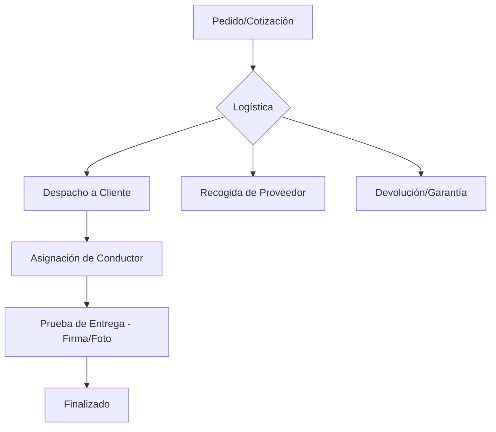

# 📦 Appenvios: Manual Funcional y Guía de Usuario
### *Help Soluciones Informáticas*

---

## 🚀 Introducción
**Appenvios** es una plataforma logística integral diseñada para optimizar el ciclo de vida de los envíos, desde la cotización inicial hasta la entrega final y el soporte técnico. Este documento detalla la funcionalidad de cada módulo para facilitar su adopción y maximizar la eficiencia operativa.

---

## 🛠️ Módulos del Sistema

### 1. 📊 Dashboard e Informes
Vista general del rendimiento operativo. Permite visualizar métricas clave (KPIs) como el número de despachos, recogidas pendientes y el cumplimiento de acuerdos de nivel de servicio (SLA).
- **Funcionalidad**: Resumen por usuario, conteo de operaciones mensuales y filtros por fecha.

### 2. 🚚 Logística (El Corazón de la App)
Gestiona el movimiento físico de mercancía en cuatro categorías críticas:
- **Despachos**: Control de salidas a clientes. Permite asignar conductores, rastrear el estado (Preparando, Despachado, Entregado) y cargar pruebas visuales.
- **Recogidas**: Gestión de ingresos desde proveedores o sedes de clientes.
- **Devoluciones**: Seguimiento de productos que retornan por garantías o ajustes.
- **Reparaciones Externas**: Control de equipos que salen a laboratorios de terceros.

### 3. 📄 Cotizaciones y Ventas
Herramienta de cara al cliente para formalizar propuestas comerciales.
- **Funcionalidad**: Creación dinámica de documentos, cálculo de utilidad automática, conversión de divisas (USD/COP) y generación de **PDFs profesionales** para envío inmediato por WhatsApp o Correo.

### 4. 👥 Gestión de Clientes y Proveedores (CRM)
Base de datos centralizada de socios estratégicos.
- **Detalle**: Registro de NIT, múltiples contactos de tesorería y contabilidad, geolocalización de sedes y gestión de cupos de crédito.

### 5. 📦 Inventario y Productos
Catálogo maestro de bienes y servicios.
- **Funcionalidad**: Control de números de parte (SKU), histórico de precios de compra y clasificación por tipo de producto/servicio.

### 6. 🚛 Conductores y Rutas
Base de datos de la flota logística.
- **Funcionalidad**: Perfiles de conductores con datos de contacto y asignación en tiempo real a las guías de despacho.

### 7. 🤖 Asistente IA (Gemini Integration)
Un asistente inteligente integrado en la plataforma que ayuda a los usuarios a navegar por los datos, generar resúmenes o resolver dudas sobre procesos internos.

---

## 📋 Flujo de Trabajo Estándar

1.  **Venta**: Se genera una **Cotización**. Al ser aprobada, se crea una **Orden de Compra** (si se requiere recoger) o un **Despacho**.
2.  **Operación**: El equipo de Logística asigna un **Conductor**.
3.  **Seguimiento**: Se monitorea el **SLA** (semáforo de tiempos: Verde < 2 días, Amarillo 3 días, Rojo > 3 días).
4.  **Cierre**: El conductor carga la **Foto de Remisión** o firma, y marca como **Entregado**.

---

## 🎨 Branding y Calidad
Este informe ha sido generado para **Help Soluciones** con el fin de ser utilizado en **NotebookLM** como fuente de conocimiento para entrenamiento de personal o auditorías de procesos.

---
*Documento propiedad de Help Soluciones Informáticas. Prohibida su reproducción sin autorización.*
