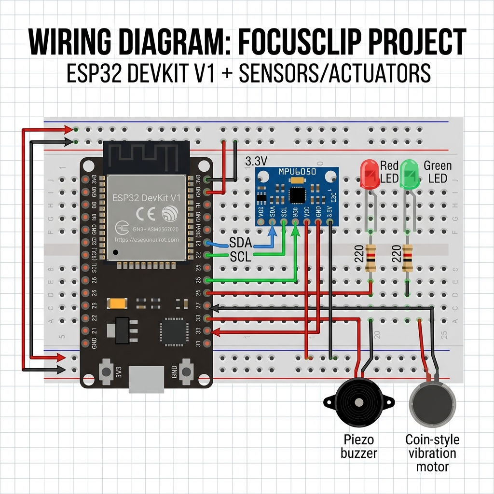

# Guía de Conexiones - FocusClip V1

Para que el código funcione correctamente, los componentes deben estar conectados siguiendo este esquema.

## Tabla de Pines (ESP32 DevKit V1)

| Componente | Pin Componente | Pin ESP32 | Función |
| :--- | :--- | :--- | :--- |
| **Sensor MPU6050** | VCC | 3.3V | Alimentación |
| | GND | GND | Tierra |
| | SDA | GPIO 21 | Datos I2C |
| | SCL | GPIO 22 | Reloj I2C |
| **LED Rojo** | Ánodo (+) | **GPIO 25** | Alerta Visual |
| **LED Verde** | Ánodo (+) | **GPIO 26** | Estado OK |
| **Buzzer** | Positivo (+) | **GPIO 27** | Alerta Sonora |
| **Vibrador** | Positivo (+) | **GPIO 33** | Alerta Táctica |

> [!IMPORTANT]
> **Resistencias:** Es obligatorio usar resistencias de 220Ω en serie con los LEDs para no dañar los pines del ESP32.

> [!TIP]
> **Vibrador:** Si el motor de vibración es muy potente, conéctalo a través de un transistor. Para los motores tipo "moneda" pequeños, el ESP32 suele poder manejarlos directamente por periodos cortos.
