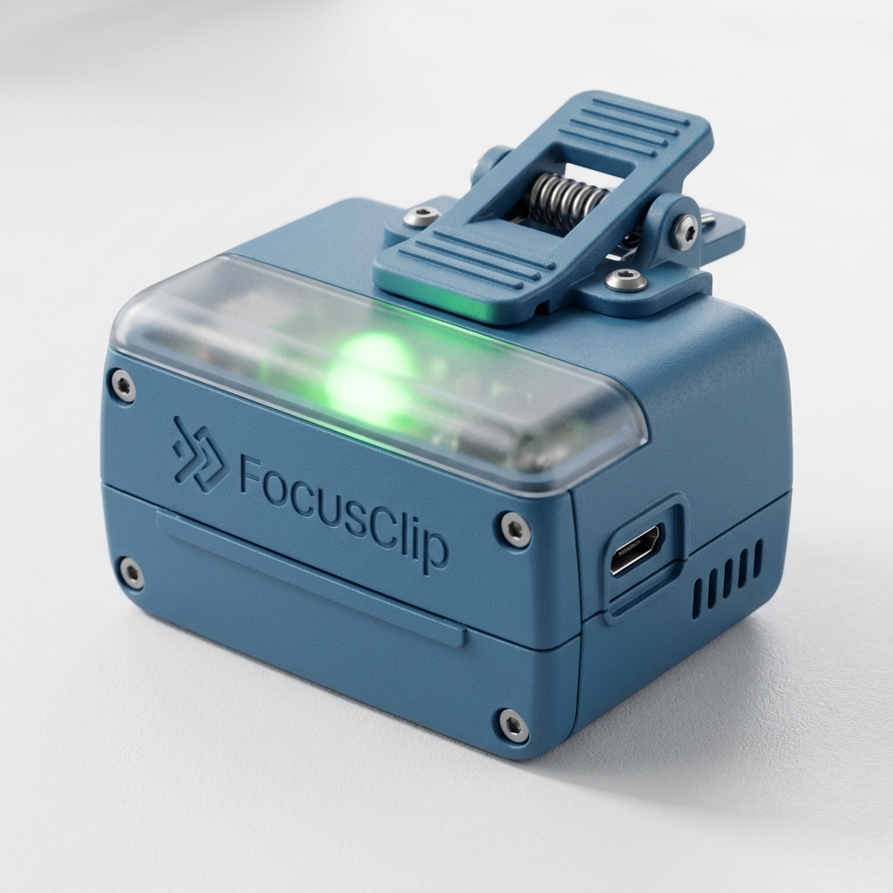

# Guía Técnica: Diseño 3D FocusClip V1

Esta guía proporciona las especificaciones necesarias para modelar la carcasa del FocusClip en software como Tinkercad, Fusion 360 o SolidWorks.

## 1. Dimensiones Sugeridas (Cuerpo Principal)
*   **Ancho:** 65 mm
*   **Alto:** 40 mm
*   **Profundidad:** 25 mm
*   **Grosor de pared:** 2 mm (mínimo para resistencia)

## 2. Alojamiento de Componentes
| Componente | Espacio Requerido | Ubicación Sugerida |
| :--- | :--- | :--- |
| **ESP32 DevKit V1** | 52x29 mm | Base de la caja |
| **MPU-6050** | 20x15 mm | Atornillado a la base o pegado firmemente |
| **LEDs (2x)** | 5 mm de diámetro | Tapa superior (visibles) |
| **Buzzer** | 12 mm de diámetro | Cerca de ranuras frontales |

## 3. El Mecanismo de Clip
Para que el clip sea funcional y no se rompa al imprimir:
*   **Diseño:** Tipo "gancho en C" o pinza con muelle.
*   **Apertura:** 18 mm (estándar para la mayoría de monitores y bordes de escritorio).
*   **Refuerzo:** El área donde el clip se une a la caja debe tener un filete (curvatura) para evitar puntos de quiebre.

## 4. Parámetros de Impresión 3D Recomendados
*   **Material:** PLA (Fácil de imprimir) o PETG (Más resistente al calor y flexible).
*   **Relleno (Infill):** 20% - 30% (Patrón Giróide para mayor resistencia).
*   **Soportes:** Necesarios para el clip y los huecos de los puertos.
*   **Orientación:** Imprimir la tapa y la base por separado, con las caras planas hacia la cama.

## 5. Checklist de Diseño
- [ ] ¿Hay un hueco para el conector USB?
- [ ] ¿El MPU-6050 tiene donde sujetarse sin moverse?
- [ ] ¿Hay agujeros para que salga el sonido del buzzer?
- [ ] ¿Los LEDs entran a presión o necesitan pegamento?

