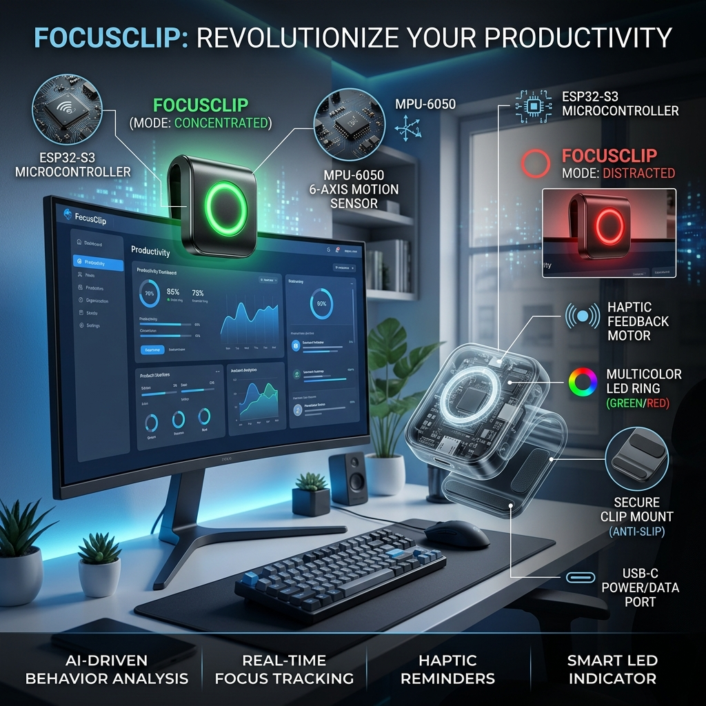
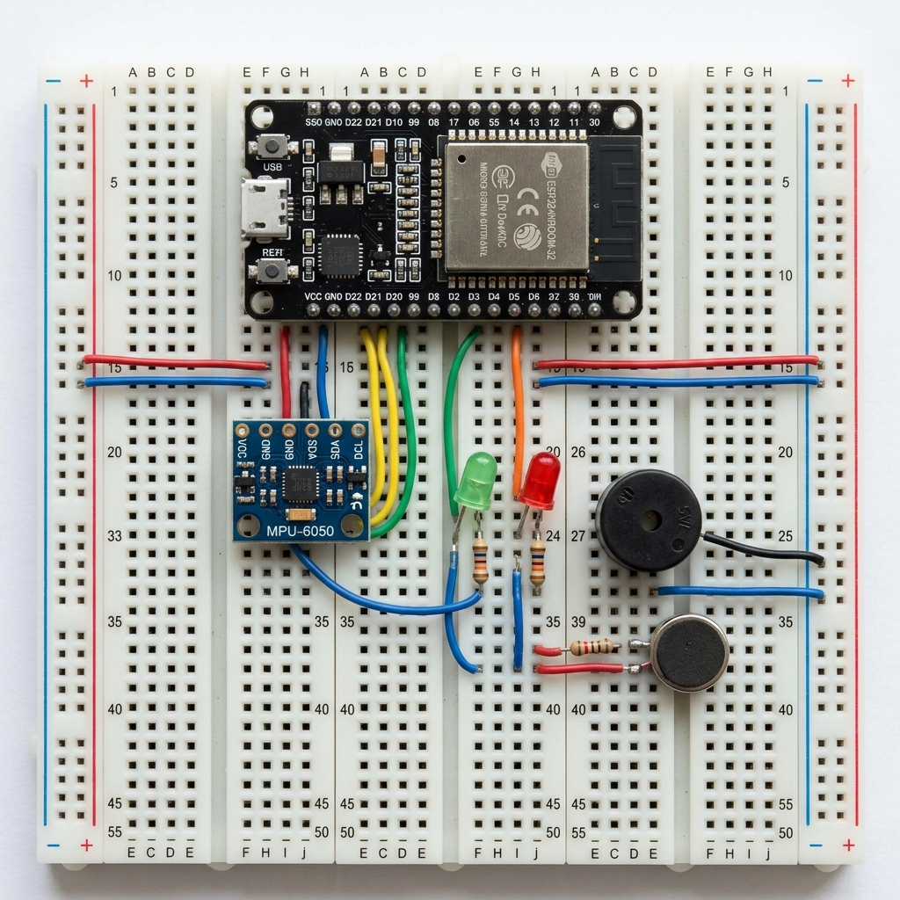

# FocusClip: Innovación para el TDAH en el Aula





## Concepto
**FocusClip** es un dispositivo de asistencia tecnológica diseñado para ayudar a estudiantes con TDAH (Trastorno por Déficit de Atención e Hiperactividad) a mejorar su autoconciencia sobre la distracción motora.

### Funcionamiento (V1 Desktop)
1.  **Detección:** El dispositivo se engancha al borde del monitor o escritorio. Mediante un acelerómetro de precisión, detecta vibraciones o movimientos bruscos en el área de estudio que indican inquietud.
2.  **Feedback Inmediato:**
    *   **Estado Concentrado:** El anillo LED brilla en **Verde**.
    *   **Estado Distraído:** El anillo LED cambia a **Rojo**, emite una **vibración sutil** y un **tono sonoro**.
3.  **Telemetría:** Los datos se envían vía WiFi a una base de datos para su análisis posterior por parte de investigadores o padres.

## Especificaciones Técnicas

| Módulo | Especificación |
| :--- | :--- |
| **Controlador** | ESP32 (Dual Core, WiFi/BT) |
| **Sensor** | MPU-6050 (Acelerómetro + Giroscopio) |
| **Alertas** | LED RGB Neopixel, Buzzer, Motor Háptico |
| **Vibrador** | GPIO 33 | Digital Out | Alerta Táctil |
| **Backend** | Supabase + n8n |

### Guía de Cableado V1 (Basado en tu Foto)

| Componente | Pin ESP32 | Fila Protoboard | Lado |
| :--- | :--- | :--- | :--- |
| **MPU-6050 VCC** | 3V3 | Fila 1 | Izquierdo (Col A) |
| **MPU-6050 GND** | GND | Fila 2 | Izquierdo (Col A) |
| **MPU-6050 SDA** | D21 | Fila 11 | Izquierdo (Col A) |
| **MPU-6050 SCL** | D22 | Fila 14 | Izquierdo (Col A) |
| **Buzzer (+)** | D27 | Fila 6 | Derecho (Col J) |
| **LED Verde (+)** | D26 | Fila 7 | Derecho (Col J) |
| **LED Rojo (+)** | D25 | Fila 8 | Derecho (Col J) |
## Versión Compacta V1.1 (Recomendada)

Para ahorrar espacio, utilizaremos los rieles laterales (+ y -) de la protoboard:

1.  **Puente de Poder**: Cable de **3.3V (Fila 1)** al riel **(+)** y **GND (Fila 2)** al riel **(-)**.
2.  **Distribución**: Todos los sensores y LEDs sacan su energía y tierra directamente de estos rieles laterales.
3.  **Ubicación**: El sensor MPU-6050 se coloca en las filas finales (25-30) para dejar espacio a los LEDs en el centro.


## Diagrama de Conexión (Wiring)

Para la **V1 Desktop**, utilizaremos los siguientes pines del ESP32. Es importante usar resistencias de 220Ω para los LEDs para evitar daños.

```


---

